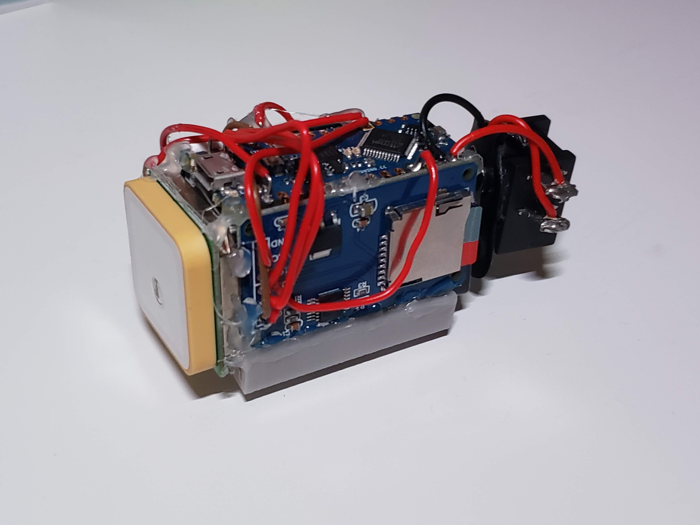
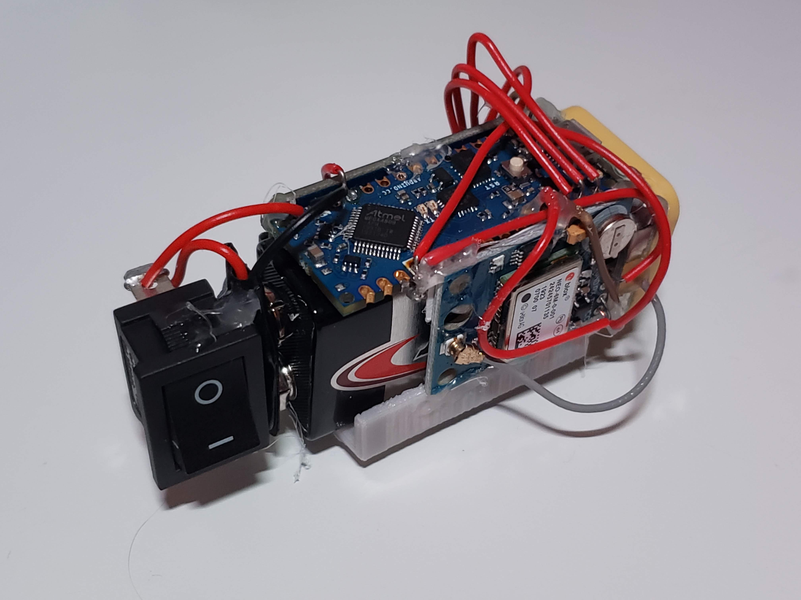
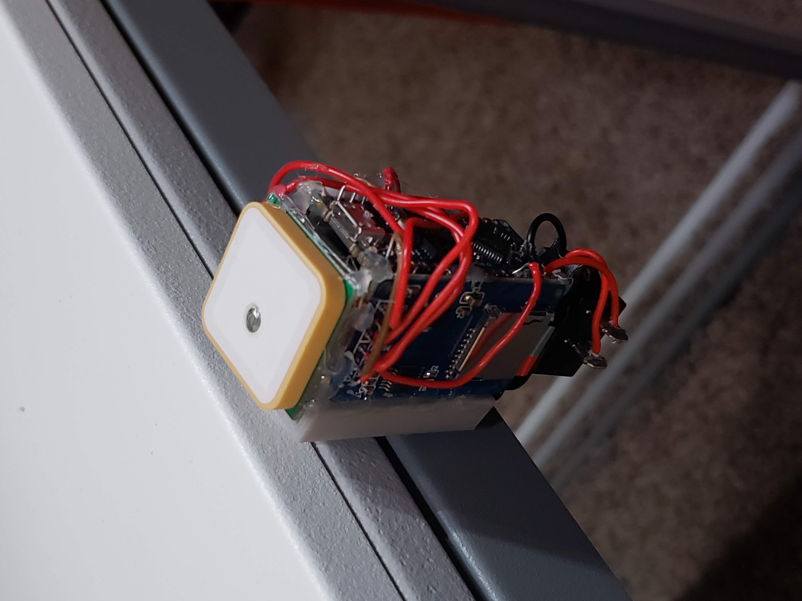
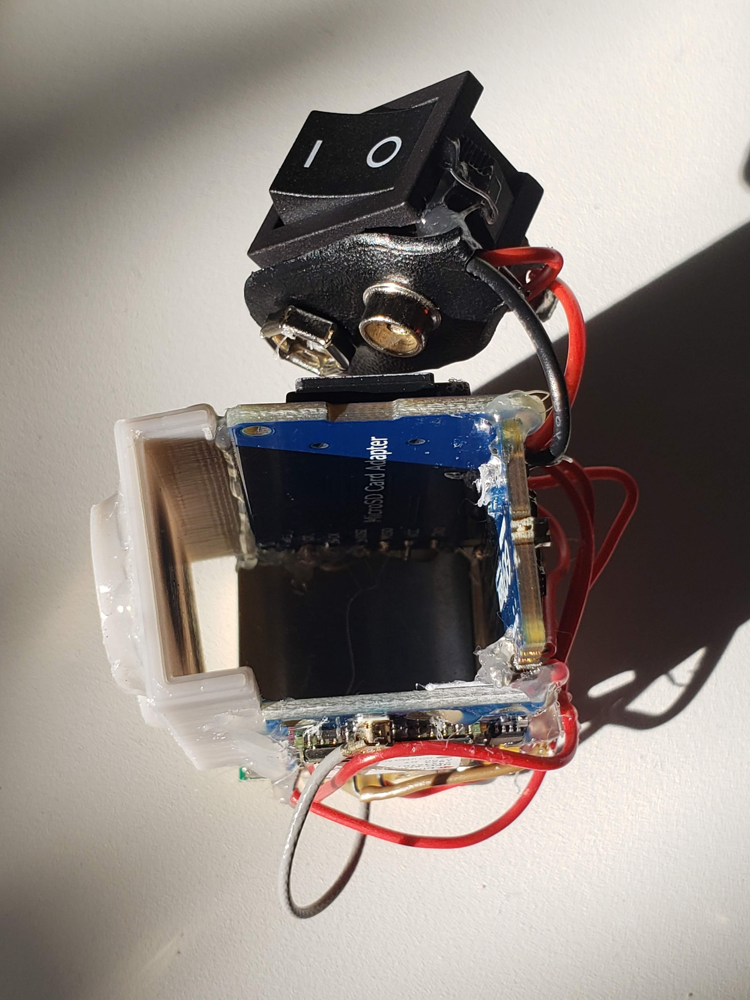
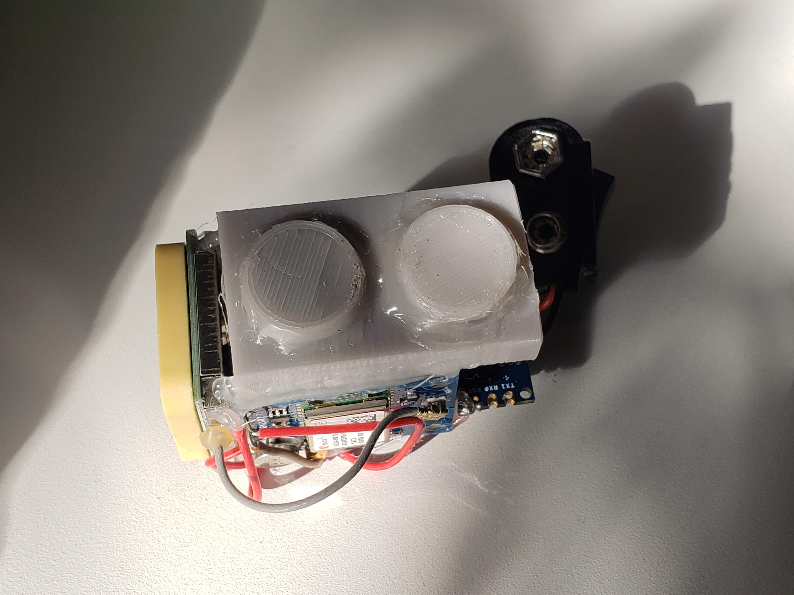

# game-rectangular-prism
## Description
Logs location data to a micro SD card to display on a map. Built around a 9v battery with an Arduino Nano, NEO-6M GPS board and receiver, Micro SD card reader, and a pair of neodymium magnets.
## Photos

## License
GPL-3.0 License
